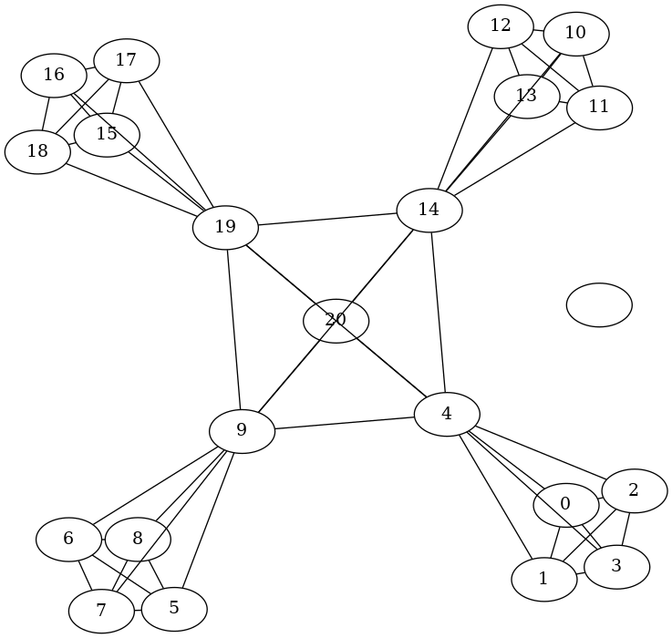
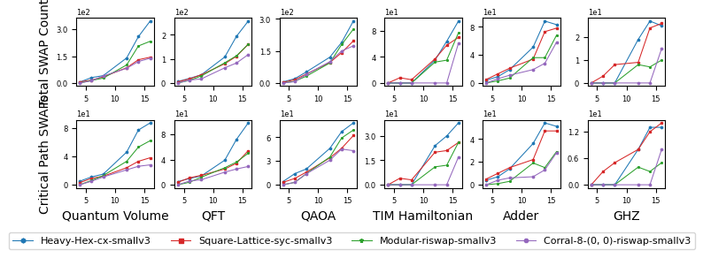
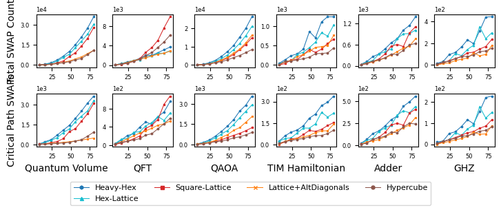
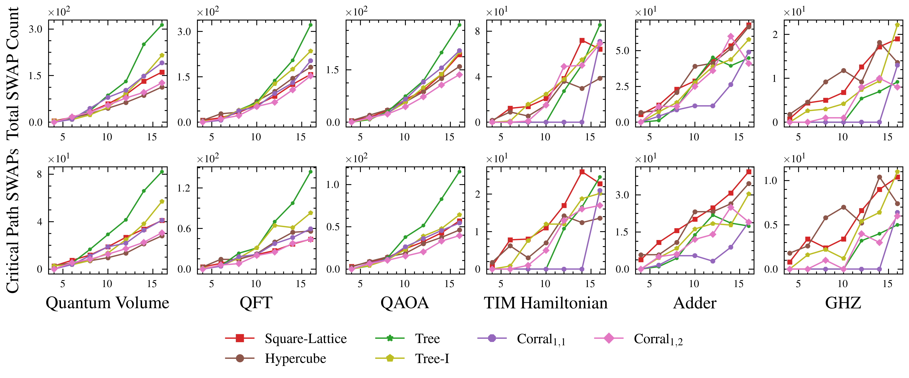
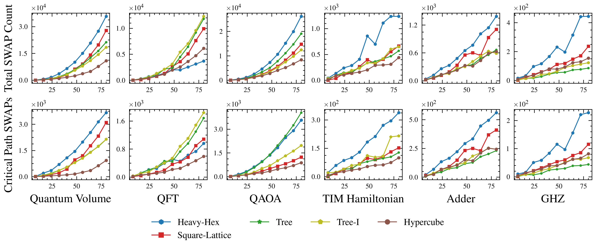
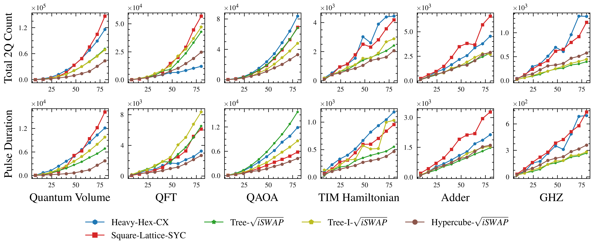
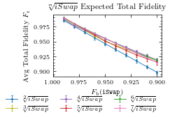
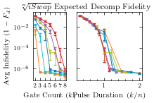

# CLONK-CoupLing tOpology beNchmarKs

Link to paper: [https://ieeexplore.ieee.org/abstract/document/10071036](https://ieeexplore.ieee.org/abstract/document/10071036)


## 📌 Project Overview
- **Overview**: This project innovates in the field of superconducting quantum computers by employing a SNAIL modulator to mitigate noise challenges prevalent in NISQ systems. It enhances qubit coupling and overall performance, offering a robust alternative to traditional designs.
  
- **Objective**: To develop, optimize, and benchmark a SNAIL-based quantum computing architecture that excels in noise management and qubit coupling efficiency.

- **What's Inside**: 
  - **ConfigurableBackendV2**: A module for programmatically creating qubit-connectivity backends.
  - **Transpilation Pass Manager**: Designed for quick basis gate translation.
  - **Circuit and Backend Suites**: Includes `circuit_suite.py` and `backend_suite_v3.py` for various benchmarks.
  - **Demo**: See `HPCA_artifact.ipynb` for a comprehensive demo focused on topology diameters and data movement operations.

## 🚀 Getting Started

Install using pip:
```
pip install -e git+https://github.com/Pitt-JonesLab/clonk_transpilation#egg=clonk_transpilation
```

or get started by exploring the main demo located at `HPCA_artifact.ipynb`.

### 📋 Prerequisites

- Set up everything using `make init` command.

- **Package Dependencies**:

  - Dependency for topology plots: `sudo apt install graphviz`


## 💻🐒 Usage


### Backend Creation

In ```/src/clonk/backend_utils/mock_backends```, target topologies are created by implementing ```ConfigurableFakeBackendV2``` which is an abstract class defined in ```src/clonk/backend_utils/configurable_backend_v2.py```


```python
from src.clonk.backend_utils.topology_visualization import pretty_print
from src.clonk.backend_utils.mock_backends import FakeModular

pb = FakeModular(module_size=5, children=4, total_levels=2)
pretty_print(pb)
```


    

#### Decomposition Transpiler Pass
The pass manager for data collection is defined in ```/src/clonk/utils/transpiler_passes/pass_manager_v3.py```, which needs additional decomposition passes for $\sqrt{\texttt{iSwap}}$ and $\texttt{SYC}$ gates. Next, we test the $\sqrt{\texttt{iSwap}}$ pass by showing that it's Haar score tends to 2.21 as expected


```python
from qiskit.quantum_info.random import random_unitary
from qiskit import QuantumCircuit
from src.clonk.utils.riswap_gates.riswap import RiSwapGate
from src.clonk.utils.transpiler_passes.weyl_decompose import RootiSwapWeylDecomposition
from qiskit.transpiler.passes import CountOps
from qiskit.transpiler import PassManager
from tqdm import tqdm

N = 2000
basis_gate = RiSwapGate(0.5)

pm0 = PassManager()
pm0.append(RootiSwapWeylDecomposition(basis_gate=basis_gate))
pm0.append(CountOps())

res = 0
for _ in tqdm(range(N)):
    qc = QuantumCircuit(2)
    qc.append(random_unitary(dims=4), [0, 1])
    pm0.run(qc)
    res += pm0.property_set["count_ops"]["riswap"]
print("Haar score:", res / N)
```

    100%|██████████| 2000/2000 [00:10<00:00, 189.84it/s]

    Haar score: 2.1925


#### Creating a Benchmark
We need to define the circuits, circuit sizes, topologies, and basis gates we want to transpile to and plot results for. We do this by wrapping the backend object and its transpiler pass manager into an object that handles data collection in ```src/clonk/benchmark_suite/backend_suite_v3.py```. The set used for data collection in the paper are in ```src/clonk/benchmark_suite/backend_suite_v2.py```. The relevant change is that 'v3' uses a slightly more optimized pass manager (optimized for time). To reproduce the results we include the `v2` versions which can regenerate the data from scratch by setting the `overwrite` parameter


```python
from src.clonk.benchmark_suite.backend_suite_v3 import simple_backends_v3

print([backend.label for backend in simple_backends_v3])
```

    ['Heavy-Hex-cx-smallv3', 'Square-Lattice-syc-smallv3', 'Modular-riswap-smallv3', 'Corral-8-(0, 0)-riswap-smallv3']


Note: We make a modification in Supermarq for the efficient generation of QAOA circuits that eliminates the need to optimize the 1Q gate parameters, but will not effect our results. To fix in interim, comment out ```supermarq/benchmarks/qaoa_vanilla_proxy.py```, line 40 and replace with:
```python 
#self.params = self._gen_angles()
self.params = np.random.uniform(size=2) * 2 * np.pi
```


```python
from src.clonk.benchmark_suite.circuit_suite import circuits

q_size = 4
circuits["QAOA_Vanilla"].circuit_lambda(q_size).decompose().draw()
```


<pre style="word-wrap: normal;white-space: pre;background: #fff0;line-height: 1.1;font-family: &quot;Courier New&quot;,Courier,monospace">global phase: 3.757
      ┌─────────┐                                                    »
 q_0: ┤ U2(0,π) ├──■─────────────────■────■──────────────────■────■──»
      ├─────────┤┌─┴─┐┌───────────┐┌─┴─┐  │                  │    │  »
 q_1: ┤ U2(0,π) ├┤ X ├┤ U1(3.757) ├┤ X ├──┼──────────────────┼────┼──»
      ├─────────┤└───┘└───────────┘└───┘┌─┴─┐┌────────────┐┌─┴─┐  │  »
 q_2: ┤ U2(0,π) ├───────────────────────┤ X ├┤ U1(-3.757) ├┤ X ├──┼──»
      ├─────────┤                       └───┘└────────────┘└───┘┌─┴─┐»
 q_3: ┤ U2(0,π) ├───────────────────────────────────────────────┤ X ├»
      └─────────┘                                               └───┘»
m0: 4/═══════════════════════════════════════════════════════════════»
                                                                     »
«                         ┌────────────┐             ┌─┐          »
« q_0: ────────────────■──┤ R(10.21,0) ├─────────────┤M├──────────»
«                      │  └────────────┘             └╥┘          »
« q_1: ────────────────┼────────■─────────────────────╫───■───────»
«                      │        │                     ║   │       »
« q_2: ────────────────┼────────┼─────────────────────╫───┼────■──»
«      ┌────────────┐┌─┴─┐    ┌─┴─┐     ┌───────────┐ ║ ┌─┴─┐┌─┴─┐»
« q_3: ┤ U1(-3.757) ├┤ X ├────┤ X ├─────┤ U1(3.757) ├─╫─┤ X ├┤ X ├»
«      └────────────┘└───┘    └───┘     └───────────┘ ║ └───┘└───┘»
«m0: 4/═══════════════════════════════════════════════╩═══════════»
«                                                     0           »
«                                                                              
« q_0: ────────────────────────────────────────────────────────────────────────
«                                                          ┌────────────┐┌─┐   
« q_1: ─────────────────────────■───────────────────────■──┤ R(10.21,0) ├┤M├───
«                             ┌─┴─┐     ┌────────────┐┌─┴─┐├────────────┤└╥┘┌─┐
« q_2: ────────────────■──────┤ X ├─────┤ U1(-3.757) ├┤ X ├┤ R(10.21,0) ├─╫─┤M├
«      ┌────────────┐┌─┴─┐┌───┴───┴────┐└────┬─┬─────┘└───┘└────────────┘ ║ └╥┘
« q_3: ┤ U1(-3.757) ├┤ X ├┤ R(10.21,0) ├─────┤M├──────────────────────────╫──╫─
«      └────────────┘└───┘└────────────┘     └╥┘                          ║  ║ 
«m0: 4/═══════════════════════════════════════╩═══════════════════════════╩══╩═
«                                             3                           1  2 </pre>


```python
"""Example:"""

from src.clonk.benchmark_suite.main_plotting import benchmark, plot_wrap

for circuit_gen in circuits.values():
    benchmark(
        backends=simple_backends_v3,
        circuit_generator=circuit_gen,
        q_range=[4, 6, 8, 12, 14, 16],
        continuously_save=1,
        overwrite=0,  # NOTE: turn this to 1 if you want to scrap the saved data and recollect a new batch
        repeat=1,
    )

# NOTE when plotting use motivation = 1 to plot SWAP counts, and motivation = 0 to plot gate durations
plot_wrap(simple_backends_v3, circuits.keys(), motivation=True, plot_average=True)
```

    Starting benchmark for Quantum_Volume
    Starting benchmark for QFT
    Starting benchmark for QAOA_Vanilla
    Starting benchmark for TIM_Hamiltonian
    Starting benchmark for Adder
    Starting benchmark for GHZ

    

    

## 📊 Results & Comparisons


```python
"""Fig 4"""
from src.clonk.benchmark_suite.backend_suite_v2 import motivation_backends

for circuit_gen in circuits.values():
    benchmark(
        backends=motivation_backends,
        circuit_generator=circuit_gen,
        q_range=motivation_backends[0].q_range,
        continuously_save=True,
        overwrite=False,
        repeat=1,
    )
plot_wrap(motivation_backends, circuits.keys(), motivation=True, plot_average=True)
```

    Starting benchmark for Quantum_Volume
    Starting benchmark for QFT
    Starting benchmark for QAOA_Vanilla
    Starting benchmark for TIM_Hamiltonian
    Starting benchmark for Adder
    Starting benchmark for GHZ

    

    

```python
"""Fig 10"""
from src.clonk.benchmark_suite.backend_suite_v2 import small_results_backends

for circuit_gen in circuits.values():
    benchmark(
        backends=small_results_backends,
        circuit_generator=circuit_gen,
        q_range=small_results_backends[0].q_range,
        continuously_save=True,
        overwrite=False,
        repeat=1,
    )
plot_wrap(small_results_backends, circuits.keys(), motivation=True, plot_average=True)
```

    Starting benchmark for Quantum_Volume
    Starting benchmark for QFT
    Starting benchmark for QAOA_Vanilla
    Starting benchmark for TIM_Hamiltonian
    Starting benchmark for Adder
    Starting benchmark for GHZ



    
```python
# """Fig 12"""
from src.clonk.benchmark_suite.backend_suite_v2 import results_backends

for circuit_gen in circuits.values():
    benchmark(
        backends=results_backends,
        circuit_generator=circuit_gen,
        q_range=results_backends[0].q_range,
        continuously_save=True,
        overwrite=False,
        repeat=1,
    )
plot_wrap(results_backends, circuits.keys(), motivation=True, plot_average=True)
```

    Starting benchmark for Quantum_Volume
    Starting benchmark for QFT
    Starting benchmark for QAOA_Vanilla
    Starting benchmark for TIM_Hamiltonian
    Starting benchmark for Adder
    Starting benchmark for GHZ



    
```python
"""Fig 13"""
from src.clonk.benchmark_suite.backend_suite_v2 import small_results_part2_backends

for circuit_gen in circuits.values():
    benchmark(
        backends=small_results_part2_backends,
        circuit_generator=circuit_gen,
        q_range=small_results_part2_backends[0].q_range,
        continuously_save=True,
        overwrite=False,
        repeat=1,
    )
plot_wrap(
    small_results_part2_backends, circuits.keys(), motivation=False, plot_average=True
)
```

    Starting benchmark for Quantum_Volume
    Starting benchmark for QFT
    Starting benchmark for QAOA_Vanilla
    Starting benchmark for TIM_Hamiltonian
    Starting benchmark for Adder
    Starting benchmark for GHZ

    

    
    
```python
"""Fig 14"""
plot_wrap(results_backends, circuits.keys(), motivation=False, plot_average=True)
```




### Finally, we use a quick calculation which converts the transpiled circuit data into useable numbers for the fidelity models.


```python
from src.clonk.benchmark_suite.backend_suite_v2 import small_results_part2_backendsv2
from qiskit.converters import circuit_to_dag
import numpy as np

ignore = ["u"]

for circuit_gen in circuits.values():  # [circuits['Quantum_Volume']]:
    print(circuit_gen.label)
    qc = circuit_gen.circuit_lambda(16)

    for backend in small_results_part2_backendsv2:
        print(backend.label)
        c = backend.pass_manager.run(qc)  # transpile :)
        d = circuit_to_dag(c)
        w = d.qubits  # if use wires error bc returns classical bits

        qubit_wire_counts = np.zeros(20)
        for i, wi in enumerate(w):
            for node in d.nodes_on_wire(wi, only_ops=True):
                if node.name in ignore:
                    continue
                # count the 2Q ops
                if node.name in ["cx", "fSim", "riswap"]:
                    qubit_wire_counts[i] += 1

        # print(qubit_wire_counts)
        print(sum(qubit_wire_counts))
```

### Approximate Decomposition

Need to have cloned this fork https://github.com/evmckinney9/NuOp to function. Since it is not packaged, I put it in a directory called external to make the imports inside ```nuop_script.py work```. 


```python
from src.clonk.benchmark_suite.nuop_script import create_plot2, collect_random2q_data
```


```python
N = 20
base_fidelity_list = [0.97, 0.98, 1 - 10e-3, 1 - 5e-3, 1 - 10e-4, 1]
filename = f"src/clonk/benchmark_suite/data-archive2/data1_random.h5"  # NOTE preloaded, change name of file to recollect
gate_error, decomp_error, fidelity_error = collect_random2q_data(
    1 - 10e-3, N=N, mode="random", fn=filename
)
```

```python
create_plot2(gate_error, decomp_error, fidelity_error, plot_bool=0, fn=filename);
```




```python
create_plot2(gate_error, decomp_error, fidelity_error, plot_bool=1, fn=filename);
```


    

## 📚 Reference

```bibtex
@inproceedings{mckinney2023co,
  title={Co-Designed Architectures for Modular Superconducting Quantum Computers},
  author={McKinney, Evan and Xia, Mingkang and Zhou, Chao and Lu, Pinlei and Hatridge, Michael and Jones, Alex K},
  booktitle={2023 IEEE International Symposium on High-Performance Computer Architecture (HPCA)},
  pages={759--772},
  year={2023},
  organization={IEEE}
}
```
